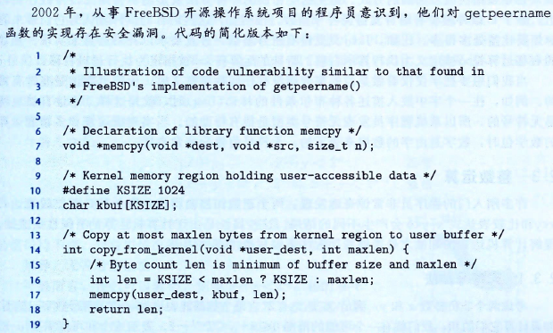

# 信息的表示和处理

## 信息的表示
### 整型的表示

Buggy Code：sign & unsign

``` C
float sum_elements(float a[], unsigned length){
    int i;
    float result = 0;
    for (i = 0; i <= length-1; i++)
        result += a[i];
    return result;
}
```

上述代码平平无奇，却暗藏玄机，在`a={}`  `length=0`的情况下，执行结果为`段错误（核心已转储）` ……

`gdb`调试发现`length-1=4294967295`！，数组的长度只有0，却一定要读取那么多个不能读取的区域，系统当然不能这么做了。那么 为什么等于0的`length`减去1之后会变成这样呢？关键就在于length的数据类型，计算机是怎样存储呢？

在代码中加入以下片段

``` C
// 打印length的字节序列
show_bytes((byte_pointer)&length, sizeof(unsigned));
// 00 00 00 00 
unsigned tmp = length - 1; 
// 打印length - 1的字节序列
show_bytes((byte_pointer)&tmp, sizeof(unsigned));
// ff ff ff ff
// 强转为有符号型
int tmp_int = (int)tmp;
// 打印 tmp_int 字节序列
show_bytes((byte_pointer)&tmp_int, sizeof(unsigned));
// ff ff ff ff
printf("%d\n", tmp_int)
// -1
```

经过实验就可以发现，无符号`unsigned` 占用4字节，为0时候全0，减去1后，变为全1，所以导致了数组越界，强转为`int`后字节序列不变，此时打印出了`-1。`

位+不同的解释=信息，实际存储的`ff ff ff ff` 解读的信息是`-1`，所用的解释就是`补码` 

> 计算机内采用二进制，在 n 位二进制的数字中，从地位到高位依次的权重为 2^0, 2^1, 2^2,...,2^(n-1)

补码与之不同的情况是最高位的权重为负权重，`ff ff ff ff` 的值就为 2^0 + 2^1 + ... + 2^30 - 2^31 = -1

#### 应用



当不怀好意的程序员在第14行传入的参数maxlen为负数的时候，len就会被赋予该数字，但是执行到17行，memcpy函数该参数的数据类型为size_t，也就是无符号数，类似于上个例子，存储的数据不变，解释方式发生变化，该参数就会从原来的负数变为非常大的正数，然后……系统就崩了。

## 布尔运算交换元素

``` C
void inplace_swap(int *x, int *y) {
    *y = *x ^ *y;
    *x = *x ^ *y;
    *y = *x ^ *y;
}
```

### 证明

体会一下这个思考过程，可以肯定的是执行了三次异或操作，异或操作有什么特点呢？

```shell
x ^ 1 = ~x
x ^ 0 = x
x ^ x = 0
```

怎么就可以不通过第三个变量交换值呢？不妨带入看看

```
line 2 : *x = *x ^ *y = (*x) ^ (*x ^ *y)
			= *x ^ *x ^ *y = 0 ^ *y = *y
line 3 : *y = *x ^ *y = (*y) ^ (*x ^ *y) = *x			
```

代码里面很简洁，很整齐，可以说是比较优雅。同样写交换变量就可以看脱颖而出，但是装逼有风险，如果两个变量相等，那么交换之后的结果可想而知，交换没成功，都没了！所以还需要判断是否相同，瞬间不给力了，这样子还不如正常的写，还是从别的方面**吧！


