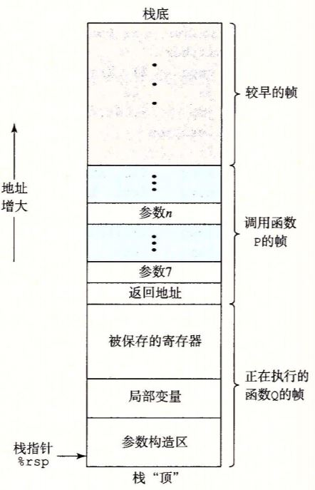
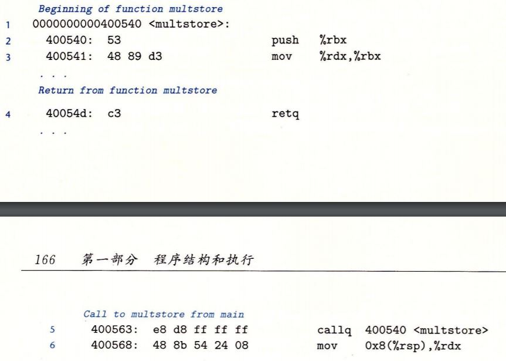
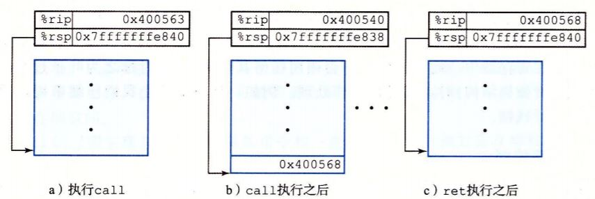
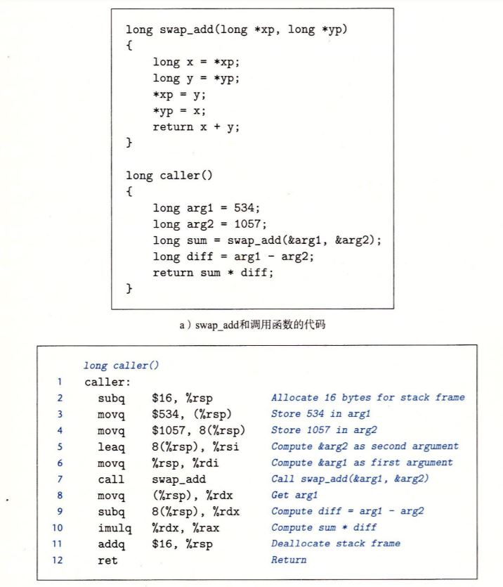
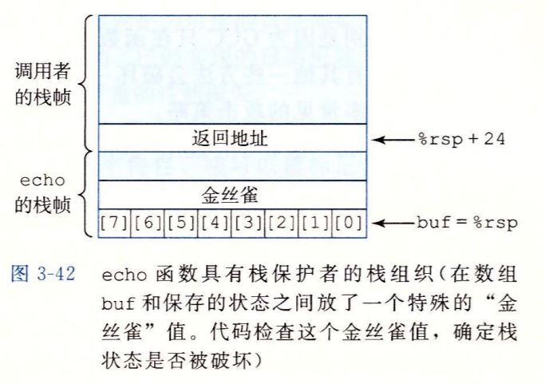

# C语言的调用细节

- C语言过程调用的实现
- 解决问题：存储器访问越界、stack overflow 攻击

## C语言过程调用

程序是怎样运行的？过程调用是怎样实现的呢？如下图

每一个程序都靠维护程序栈（图中所示）来运行，所谓程序栈，就是在内存中的一段连续存储空间，按照指定的规则运行（存储、传递、处理数据），栈顶到栈底地址从大到小。其中每一个层的调用都会创建一个帧，逐个向下扩展，等到执行结束，从下到上，帧一个个的坍塌。

可以看出，当调用的时候，先存下调用后要执行的下一条指令的地址，之后栈指针在扩展，所以每个帧的最后一个指令必然是返回地址。

而且在栈指针扩展之后，参数都是从栈顶到栈底存储，当存储的过多甚至到了上一个栈帧的返回地址的时候，就彻底破坏了程序栈的结构，谁也不知道会跳到哪里去。这就是缓冲区溢出。

## 对抗缓冲区溢出攻击

### 栈随机化

栈在程序每次运行时都有变化。

实现：程序开始前，在栈上分配一段0~n字节之间的随机大小空间

### 栈破坏检测

### 限制可执行代码区域

