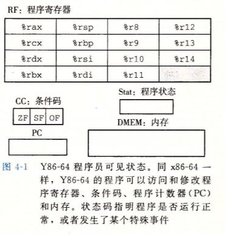
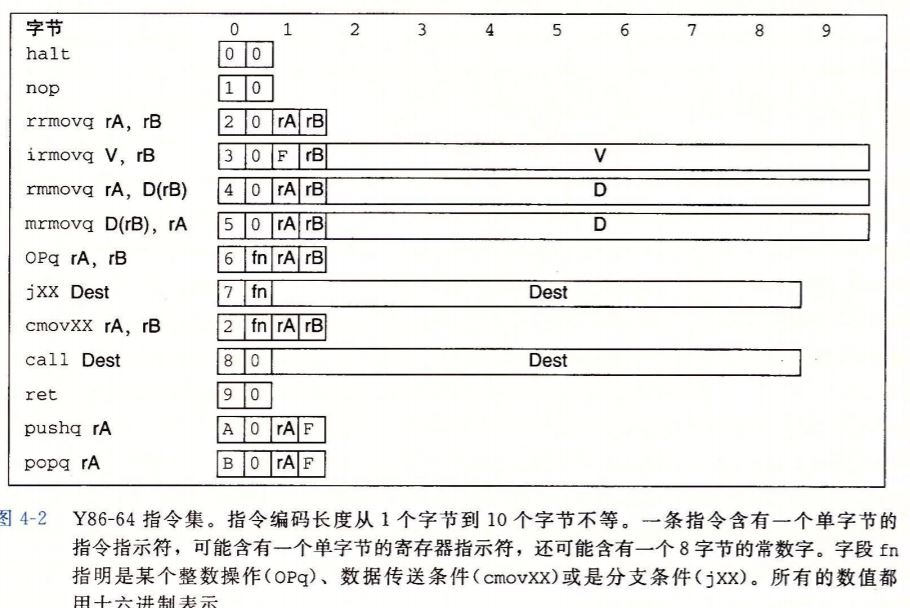
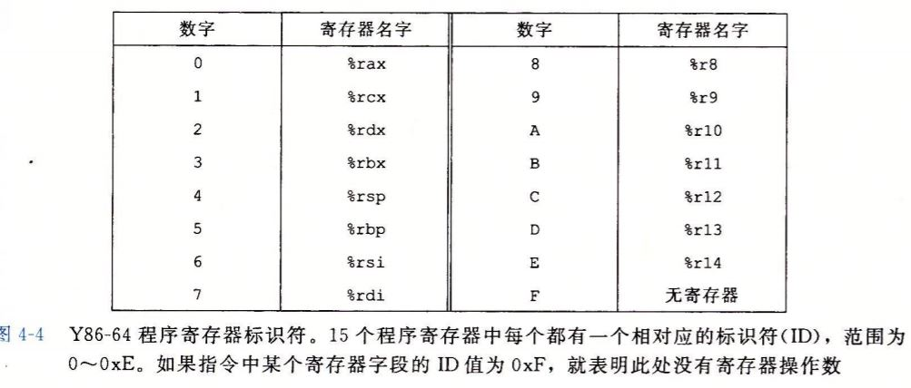

# 自定义一个Y86-64指令集体系结构

## Y86-64状态单元



## Y86-64指令集

要实现的目标



#### 指令编码

在图4-2中的指令集中，每条指令由1~10个字节组成，其中第一个字节的高4位是代码部分，0x1~0xB；低4位是功能部分（eg. mov的后缀）

#### 寄存器编码



所以图4-2中的第3-4个字节有的就指定的是标号为0xF的寄存器

#### 举例

``` assembly
rmmovq %rsp, 0x123456789abcd(%rdx)
```

对应的字节编码：由图2，rmmovq对应的编码是0x40，图4知%rsp和%rdx对应的编码是0x42，所以前4个编码是0x4042，后面的立即数首先填充位置，填满8个字节，然后采用小端法存储，最后的编码是`0x4042cdab896745230100`

## CISC & RISC

不如相互学习

RISC引入了更多的指令，很多指令要执行多个周期

CISC的核心指令集非常适合在流水线化的机器上执行

## 从C语言到二进制

