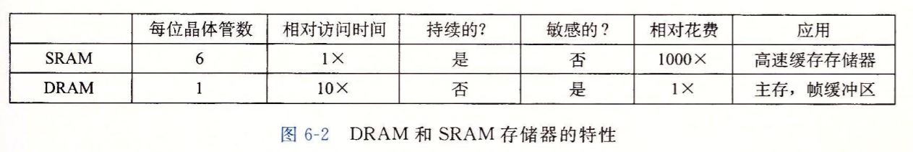
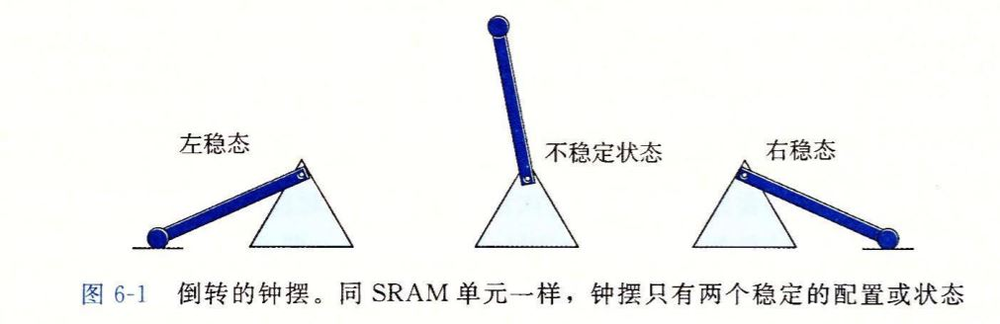
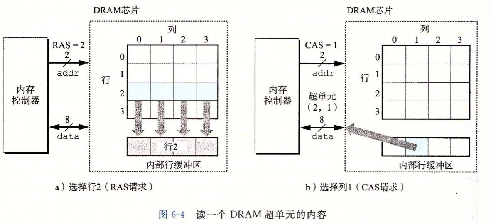
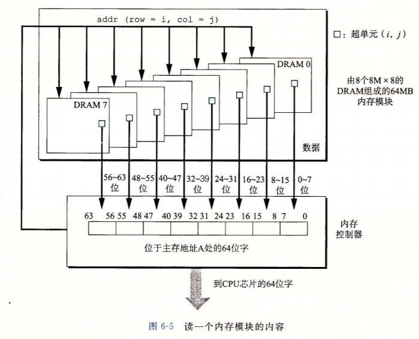
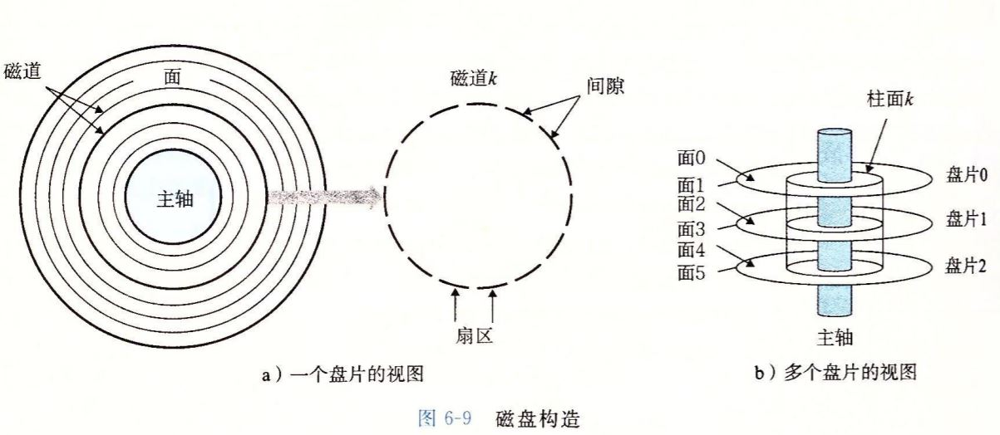
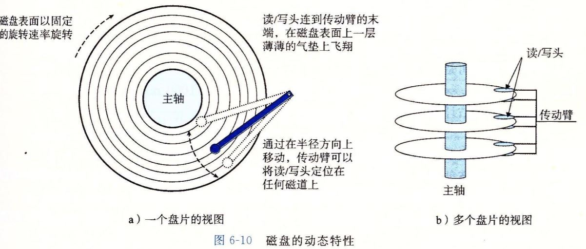

# 存储技术

运算、存储、IO是计算机的最根本的三个元素。尤其对于数据来说存储技术是最重要的。

## 1. RAM 随机访问存储器

RAM分为两类：（静态）SRAM和（动态）DRAM。

SRAM更快，更贵；用作高速缓存存储器；既可以在CPU芯片上，也可以在片下
DRAM更慢，更便宜；用作主存以及图形系统的帧缓冲区

一个桌面系统的SRAM不会超过几M字节，DRAM有几百几千M字节

### SRAM

SRAM的每个单位是由6个晶体管组成的双稳态电路。只要有电，干扰不大就可以稳定在稳定值。

### DRAM

DRAM的每个单位由一个电容和一个晶体管组成，结构决定性质，电容的不稳定性决定了DRAM对干扰信号的敏感，要求每隔一段时间必须对DRAM进行刷新。

#### DRAM的读写

如图所示是读取DRAM的示例，DRAM存储(4\*4)\*8 位的信息，括号内的是行列地址，括号外的是一个超单元存储的位数；通过内存控制器读取DRAM的信息需要两部：首先输入行地址，然后输入列地址。分两次才能读取。

#### 内存模块

多个DRAM封装组合形成了插在内存槽中的内存条

有非常多种类的DRAM，现在最常见的是DDRx，什么是DDR呢？

> DDR SDRAM **Double Data Rate Synchronous Dynamic Random Access Memory ** 双倍速率传输率的同步动态随机存储器 
> x代表第几代

## 2. ROM

无论是SRAM还是DRAM，只要是断电了，都玩儿完。ROM即使是在断电后，也会保存信息。ROM有如下几个阶段

PROM -> EPROM -> EEPROM -> 闪存

U盘的全称是**USB闪存盘**(USB flash disk)使用的是闪存技术
**固态SSD**使用的也是闪存技术
但是**硬盘**和ROM以及闪存是没有关系的

存储在ROM中的程序称为**固件**，当一个ROM设备通电的时候，会自动运行存储在ROM中的固件，比如开机的BIOS、U盘读写的程序等

## 3. 磁盘存取

磁盘仍旧是存储数据最多的设备，虽然磁盘读取信息为毫秒级，但是比DRAM慢了10万倍，比SRAM慢了100万倍。

### 磁盘构造

磁盘区别于基于闪存的SSD，磁盘盘片以主轴为中心，以固定速率旋转，每个扇区固定512字节

扇区+间隙 =》磁道 =》盘片 =》柱面 =》磁盘

### 磁盘容量

有三个参数描述磁盘的容量

- 记录密度：单位长度磁道可以存储的位
- 磁道密度：半径上单位长度上可以有的磁道数
- 面密度：磁道密度\*记录密度

因为半径不同，每一个磁道的长度也会不同，由于技术原因，每个磁道都保存相同数量的扇区，最早时候磁盘的容量由最内部的磁道决定；之后产生了多区记录：就是将柱面的集合划分为多个区，每个区包含一组连续的柱面，区内每个柱面每条磁道都有数量相同的扇区。

> 对于DRAM、SRAM这样的计量单位 K=2^10 M=2^20 G=2^30 T=2^40
> 对于网络和磁盘 K=10^3 M=10^6 G=10^9 T=10^12

### 磁盘操作

