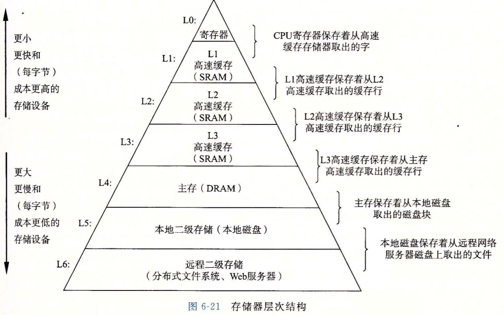
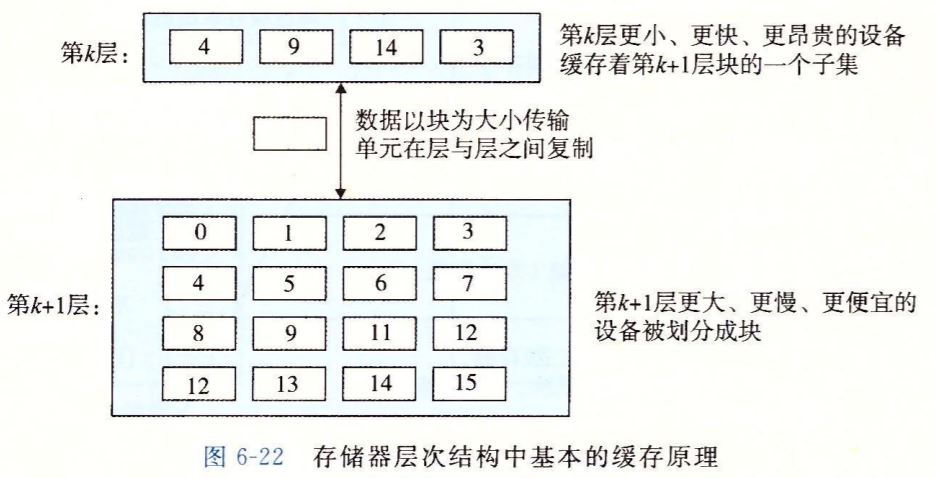
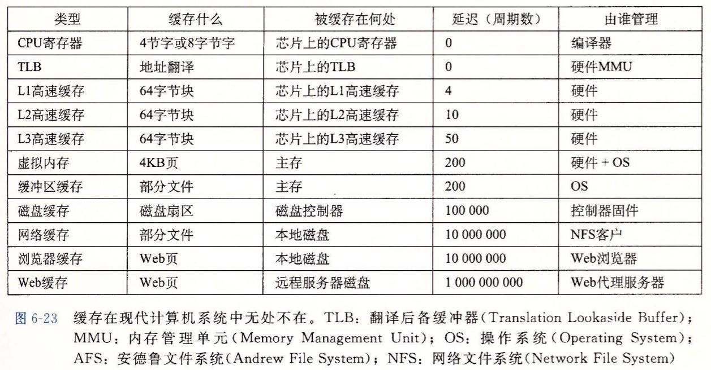

# 存储器层次结构

存储层次的本质：每一层都是下一层的缓存

## 存储层次结构中的缓存

### 缓存命中

当程序需要第k+1层（比如磁盘）的块d时，如果在第k层（比如内存）找到，也就是命中，直接返回，这比从第k+1层读取快多了。

### 缓存不命中

如果第k层没有d，那么当从第k+1层读取d的时候，也要在缓存中存储块d，如果k层缓存已满，则必须覆盖一个块（*替换*）

替换的策略中最常见的是LRU(最近最少被使用)原则，也就是替换最近访问时间最远的块。

### 缓存不命中的种类

缓存不命中有两种情况

- 缓存未满
- 缓存已满

空的缓存被称为冷缓存，如果缓存没有满，放置在哪儿呢？

对于高层（靠近CPU）的缓存，定位都是由硬件实现，随机放置很贵，所以会定制一些策略，比如上图中，第k+1层的块i的必须放置在第k层的块（i mod 4）中。

### 缓存管理

### 缓存和局部性原理

时间局部性：同一个对象可能被连续使用多次，使用LRU的缓存也就能更多的命中

空间局部性：块通常包括多个存储在一起的数据对象，对数据临近数据的访问，可以弥补多余的拷贝复制