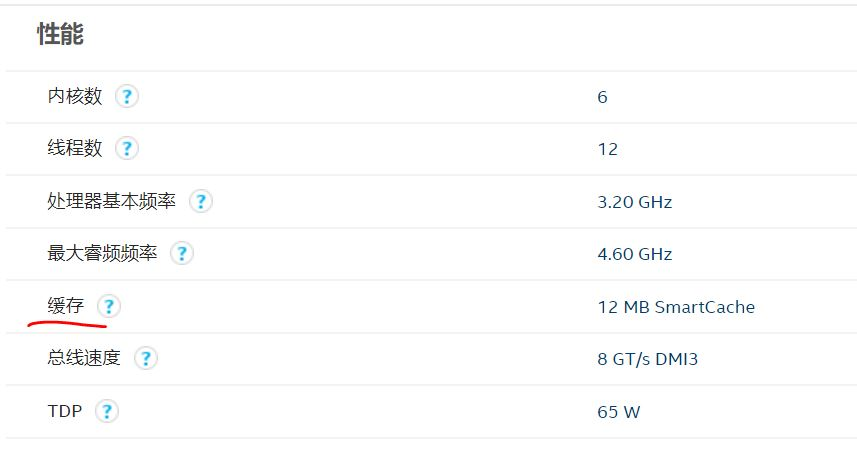
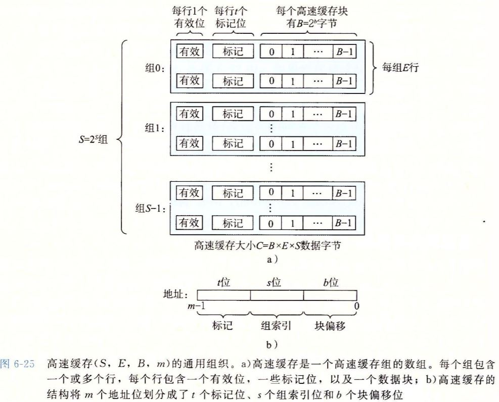
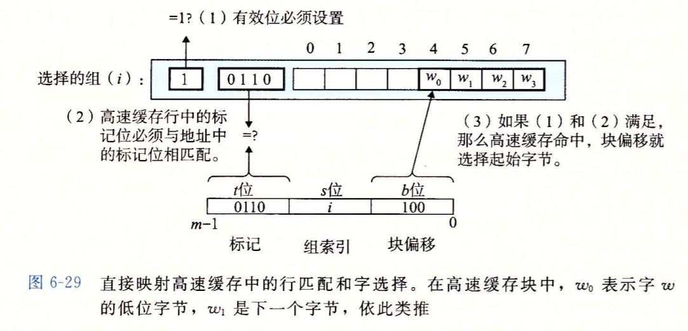
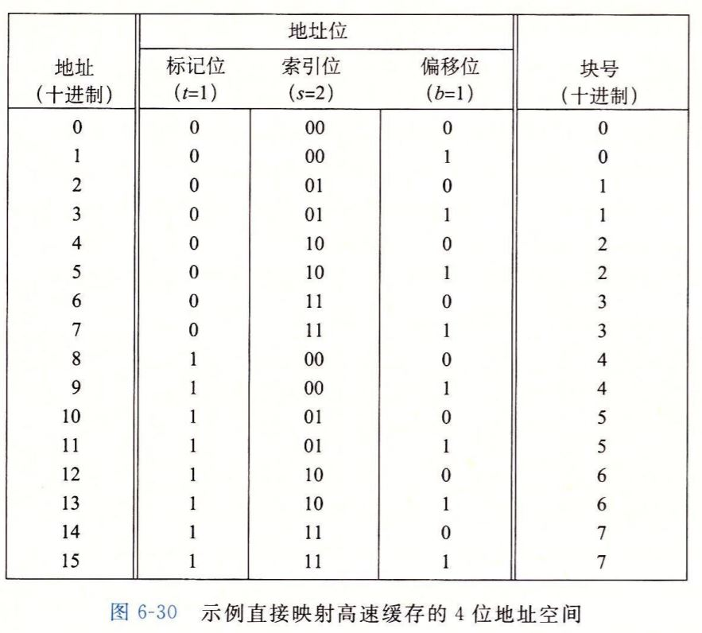
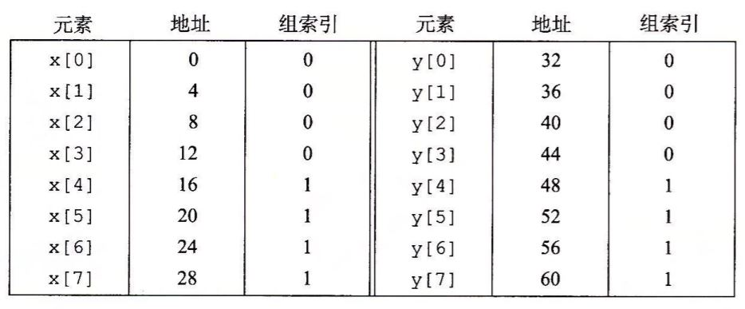
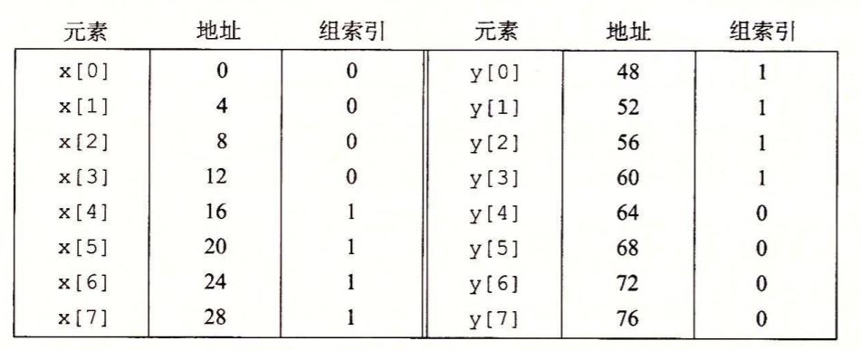
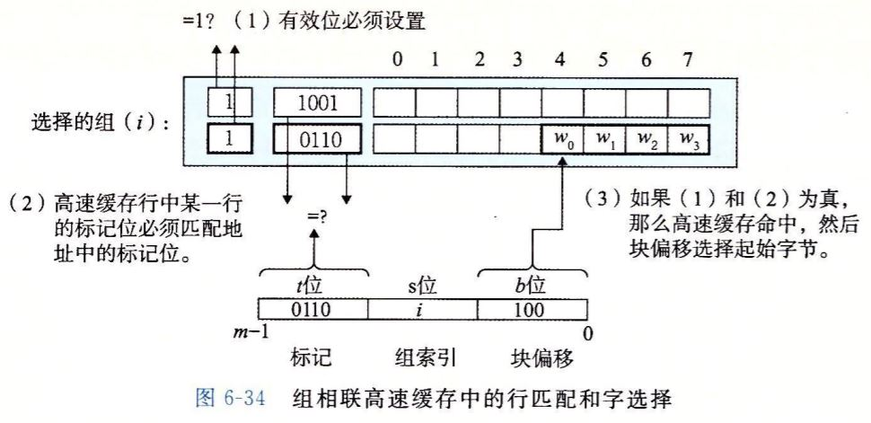
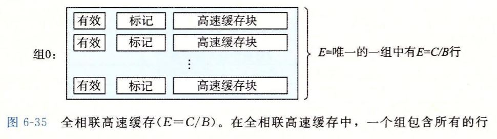
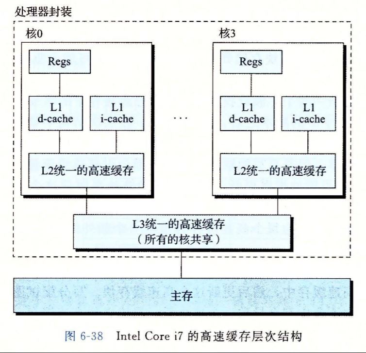

# 高速缓存存储器

早期计算机只有CPU寄存器、主存、磁盘三层存储，并且CPU和主存之间的差距逐渐增大，于是就有了在CPU和主存之间起过渡作用的高速缓存存储器。也就是CPU参数中的三级缓存



## 1 通用组织结构



如图所示，每个高速缓存存储器都有S组，每组有E行，每行有B个有效字节，所以该Cache的容量是 C=S×E×B

地址映射到Cache的过程如下

1. 将地址按照图划分为3个部分：t位标记、s位组索引、b位块偏移
2. 根据组索引找到Cache的组
3. 根据t位标记找到对应行
4. 根据块偏移找到对应的字节

## 2 直接映射高速缓存

> E（行数）为1的高速缓存称为直接映射高速缓存，最容易理解和实现。

比较以下两个程序

``` C
float dotproc(float x[8], float y[8]){
    float sum = 0;
    int i;
    
    for(i = 0; i < 8; i++)
        sum += x[i]*y[i];
    return sum;
}
```

``` C
float dotproc(float x[12], float y[8]){
    float sum = 0;
    int i;
    
    for(i = 0; i < 8; i++)
        sum += x[i]*y[i];
    return sum;
}
```

代码写的很好，同样是两个8位的向量点乘，区别在于第二个代码特意将x数组扩充成12，在某种情况下，第一个代码会比第二个慢2到3倍，背后的细节就在高速缓存存储器，高速缓存存储器是怎样工作并且影响程序性能的呢？

### 运行过程

当CPU要取内存中的地址addr的数据时，运行过程分和结构一样分三步：确定组、确定行、确定字

1. 组选择：直接根据地址中的s位，用无符号整数解释得到组号
2. 行匹配：假设每个组只有一行，查看是否命中：a. 行有效位设置为1 b. 该行标记位和addr的标记位一一对应，则该行有该数据的副本
3. 与组选择相同，将b位解释成无符号整数，确定字节数



### Demo



以上是4位举例，m=4, t=1, s=2, b=1，最右侧是内存块的编号

- 内存块有8个，但是组（cache）却只有4个，所以必然有多个内存块共享一个cache
- 标记位+索引位 唯一标识了内存中的块

当程序访问大小是2的幂的数组时，对于给出的程序，可能会发生如下现象



取x[i]后，每次取y[i]都会冲突不命中，缓存不仅没有起到作用，反而一直在做多余的动作。

放B字节的填充，修改后就变成了



## 3 组相联高速缓存

造成直接映射高速缓存冲突不命中的原因在于每组只有一行，选择考虑更复杂的情况，每组有多行

### 运行

与直接映射高速缓存不同之一在于：组中的任意一行都可以包含映射到该组的内存块，所以查找的时候要遍历所有的行。



那不命中的时候，替换哪一行呢？

> 幸运的是，程序员很难在代码里利用高速缓存替换策略

## 4 全相联高速缓存



由于行数非常多，高速缓存电路必须并行搜索标记位，很昂贵，所以全相联只适合做小的高速缓存

## 5 关于写的问题

两种形式

- 直写：每次更新直接更改到底
- 写回：额外需要一个记录的位，直到缓存被替换才写



