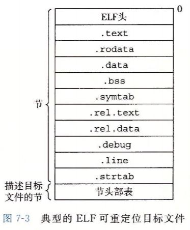
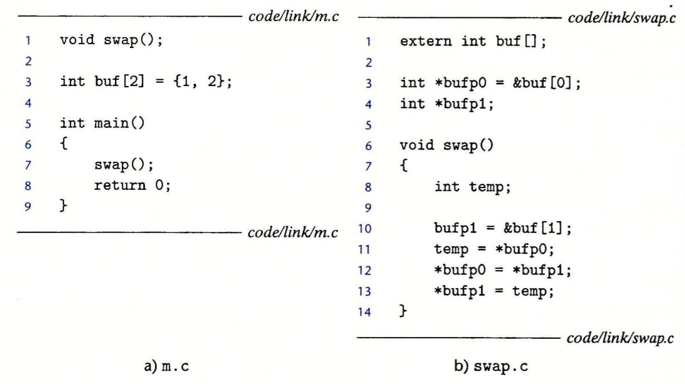
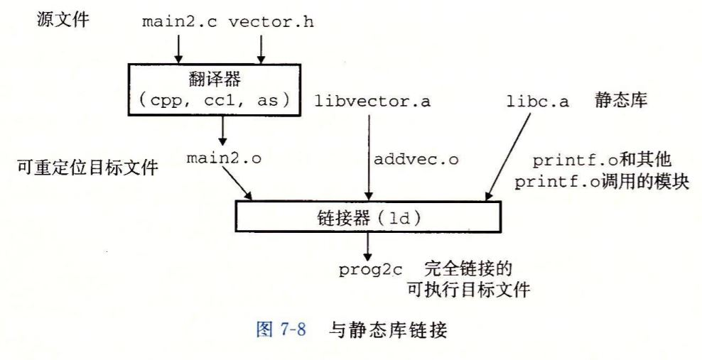

# 静态链接

链接器的两个主要任务

- 符号解析：将目标文件中的每个全局符号都绑定到一个唯一的定义
- 重定位：确定每个符号最终的内存地址

## 目标文件

首先搞清楚目标文件的几个概念，从功能上分，目标文件有三种

1. 可重定位目标文件：编译器和汇编器生成，可以和其他同类文件合并生成可执行目标文件
2. 可执行目标文件：静态链接器合并多个可重定位目标文件生成，可以直接被复制进内存并执行
3. 共享目标文件：编译器和汇编器生成，可以在加载和运行时被动态加载

操作系统不同，目标文件的格式也会不同，不过底层概念都是相通的

- Linux ELF
- Windows PE
- Mac OS-X Mach-O

## 可重定位目标文件



### 符号和符号表 `.symtab`

每个可重定位目标模块`m`都有一个符号表`symtab`，存放在程序中定义和引用的函数和全局变量的信息，在链接器的上下文中有三种符号

1. `m`定义的能被其他模块引用的全局符号：非静态的C函数和非静态的全局变量
2. 其他模块定义可以被`m`引用的全局符号（外部符号）
3. `m`定义只能m使用的符号

#### 查看符号表的内容

对于以下程序 （因为没有IO所以不需要头文件）



使用Linux工具`readelf`就可以查看目标文件符号表

``` bash
$cc -c m.c swap.c 
$readelf -a m.o
$readelf -a swap.o
```

`m.o`得到以下信息

``` bash
// m
Symbol table '.symtab' contains 12 entries:
   Num:    Value          Size Type    Bind   Vis      Ndx Name
     0: 0000000000000000     0 NOTYPE  LOCAL  DEFAULT  UND 
     1: 0000000000000000     0 FILE    LOCAL  DEFAULT  ABS m.c
     2: 0000000000000000     0 SECTION LOCAL  DEFAULT    1 
     3: 0000000000000000     0 SECTION LOCAL  DEFAULT    3 
     4: 0000000000000000     0 SECTION LOCAL  DEFAULT    4 
     5: 0000000000000000     0 SECTION LOCAL  DEFAULT    6 
     6: 0000000000000000     0 SECTION LOCAL  DEFAULT    7 
     7: 0000000000000000     0 SECTION LOCAL  DEFAULT    5 
     8: 0000000000000000     8 OBJECT  GLOBAL DEFAULT    3 buf
     9: 0000000000000000    21 FUNC    GLOBAL DEFAULT    1 main
    10: 0000000000000000     0 NOTYPE  GLOBAL DEFAULT  UND _GLOBAL_OFFSET_TABLE_
    11: 0000000000000000     0 NOTYPE  GLOBAL DEFAULT  UND swap
// swap    
Symbol table '.symtab' contains 13 entries:
   Num:    Value          Size Type    Bind   Vis      Ndx Name
     0: 0000000000000000     0 NOTYPE  LOCAL  DEFAULT  UND 
     1: 0000000000000000     0 FILE    LOCAL  DEFAULT  ABS swap.c
     2: 0000000000000000     0 SECTION LOCAL  DEFAULT    1 
     3: 0000000000000000     0 SECTION LOCAL  DEFAULT    3 
     4: 0000000000000000     0 SECTION LOCAL  DEFAULT    4 
     5: 0000000000000000     0 SECTION LOCAL  DEFAULT    5 
     6: 0000000000000000     0 SECTION LOCAL  DEFAULT    8 
     7: 0000000000000000     0 SECTION LOCAL  DEFAULT    9 
     8: 0000000000000000     0 SECTION LOCAL  DEFAULT    7 
     9: 0000000000000000     8 OBJECT  GLOBAL DEFAULT    5 bufp0
    10: 0000000000000000     0 NOTYPE  GLOBAL DEFAULT  UND buf
    11: 0000000000000008     8 OBJECT  GLOBAL DEFAULT  COM bufp1
    12: 0000000000000000    63 FUNC    GLOBAL DEFAULT    1 swap    
```

符号表包含了所有符号的信息，共有六列数据，其中`name`列存的是字符串表中的偏移（`strings m.o`可以看得到）；`Ndx`存的是该符号所在的section标号，main和swap都在text（标号为1，readefl可以看到标号代表的意义），有三个特殊ABS（不该被重定位）、UND（别处定义外部数据）、COM（没有分配位置没有初始化）；value、size、type分别是该符号在所在section的起始地址，占用空间大小和类型（数据 or 函数）

##### 局部变量&本地链接符号

局部变量在运行时被堆栈管理，在链接期间没有任何活动。

## 符号解析

### 1 解析多次定义的全局符号

编译器向汇编器输出的每个全局符号，有强弱之分，函数和初始化的全局变量是强，未初始化的全局变量为弱，强强相遇报错，强弱相遇取强，弱弱相遇随机取，这样的策略可能会带来莫名其妙的bug，尤其是变量类型不相同的时候。

### 2 链接静态库

#### 静态库

静态库以一种存档（archive）文件格式（后缀.a），将一组可重定位目标文件连接，存放到磁盘中。编译系统提供静态库，复制应用程序引用的模块即可。

#### 举例 自己做一个库

使用<https://github.com/imshenzhuo/CSAPP/tree/master/code/ch07>中的文件`addvec.c multvec.c` 

``` bash
gcc -c addvec.c multvec.c
ar rcs libvector.a addvec.o multvec.o
```

就生成了静态库文件`libvector.a`，然后在<https://github.com/imshenzhuo/CSAPP/tree/master/code/ch07>中的`main2.c`使用该静态库

``` bash
gcc -c main2.c 
gcc -static -o prog2c main2.o ./libvector.a
# or
gcc -static -o prog2c main2.o -L -lvector
```

`-static`表明之后不需要链接，直接可以加载运行

实际过程如下



链接器复制了libvector中的addvec函数，但是没有复制multvec函数，类似的只复制了libc中的printf相关函数

### 3 使用静态库来解析引用

库要放到命令行的尾部


## 重定位

符号解析后，每一个引用都对应一个定义，链接器知道了目标模块中代码段和数据段的确切大小，就可以开始重定位了。

重定位 = 合并输入模块 + 为每个符号分配运行地址

分两步

- 重定位段和符号定义：也就是合并多个段，然后将内存地址赋给新的聚合段
- 重定位段中的符号引用：修改数据段和代码段中每个符号的引用


汇编器汇编某个单独的.s文件时候，并不知道和其他文件的联系， 生成可重定位目标文件中的`.rel.data`段中，存储了链接时所需要的信息。

汇编器生成的可重定向目标文件中的`.rel.data`存储了重定位所需要的信息，并且在`.o`文件中的字节序列设置了占位符，链接器根据信息重定位确定地址写回占位符得到可执行目标文件。

TODO

