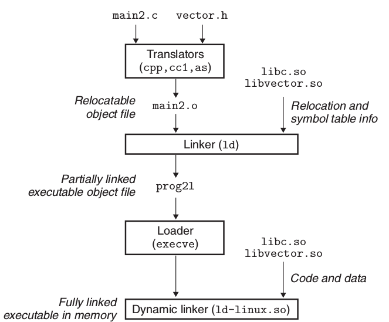

## 重定位

符号解析后，每一个引用都对应一个定义，链接器知道了目标模块中代码段和数据段的确切大小，就可以开始重定位了。

重定位 = 合并输入模块 + 为每个符号分配运行地址

分两步

- 重定位段和符号定义：也就是合并多个段，然后将内存地址赋给新的聚合段和全局变量
- 重定位段中的符号引用：修改数据段和代码段中每个符号的引用


汇编器汇编某个单独的.s文件时候，并不知道和其他文件的联系， 生成可重定位目标文件中的`.rel.data`段中，存储了链接时所需要的信息。

汇编器生成的可重定向目标文件中的`.rel.data`存储了重定位所需要的信息，并且在`.o`文件中的字节序列设置了占位符，链接器根据信息重定位确定地址写回占位符得到可执行目标文件。

## 动态链接共享库

``` bash
# 生成动态链接库
gcc -shared -fPIC -o libvector.so addvec.c multvec.c
# 执行
gcc -o prog2 main2.c ./libvector.so
```





注意到上图有两个链接过程, 一个是编译时链接(静态), 另一个加载时链接(动态), 第一次链接生成的可执行文件只是获取动态库的重定位和符号表信息, 并没有库中的代码和数据, 只有在执行的时候, 才会获取库中的代码和数据. 